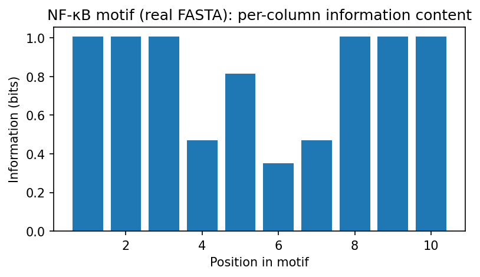
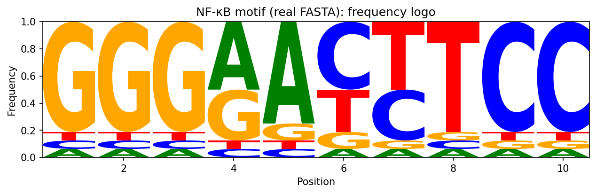
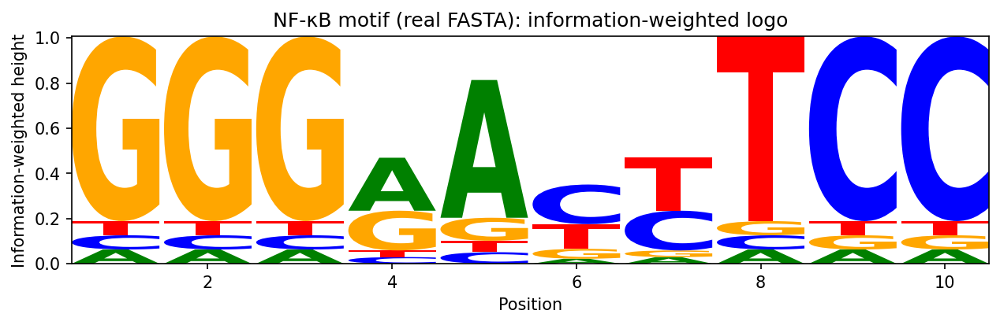

# Motif Entropy Analysis – NF-κB Example

This project computes and visualizes the entropy of NF-κB DNA binding motifs using Python and Jupyter.  
It demonstrates how entropy reflects column-wise conservation in sequence motifs and provides a reproducible pipeline for motif analysis.

---

## Problem
Transcription factors like NF-κB bind DNA at conserved sequence motifs. To quantify conservation, we can calculate **entropy per column** of a motif’s position probability matrix (PPM). Low entropy indicates strong conservation; high entropy indicates variability.

---

## Methods
1. **Data loading** – Input aligned sequences from FASTA.  
2. **PPM construction** – Compute base frequencies with pseudocounts.  
3. **Entropy & information content** –  
   \[
   H_i = - \sum_{b \in \{A,C,G,T\}} p_{i,b}\,\log_2 p_{i,b}
   \]  
   \[
   I_i = H_{bg} - H_i,\quad H_{bg}=2 \text{ bits}
   \]  
4. **Visualization** – Plot per-column information bars, sequence logos (frequency-scaled and information-weighted).  
5. **Results export** – Save per-position metrics, counts, PPM, and figures to `results/` and `figs/`.

---

## Results

Using the **real NF-κB dataset** (12 sequences, length 10):

- **Total entropy**: ~11.86 bits  
- **Total information**: ~8.14 bits  
- **Conserved positions** (1–3, 8–10) show low entropy (~1.0) and high information (~1.0).  
- **Variable positions** (4–7) have higher entropy (~1.5–1.6).  

### Example Outputs

**Per-column information bar chart**  


**Frequency sequence logo**  


**Information-weighted sequence logo**  


---

## Quick Start

**Option 1 — Run notebook interactively**
```bash
conda activate motif-entropy
jupyter notebook notebooks/01_motif_entropy_demo.ipynb

run_entropy.bat

motif-entropy-nfkb/
│
├── data/          # Example FASTA input
├── notebooks/     # Main Jupyter workflow
├── results/       # CSV outputs + summary
├── docs/figs/     # Saved figures for README/paper
└── src/           # Python scripts (optional)


